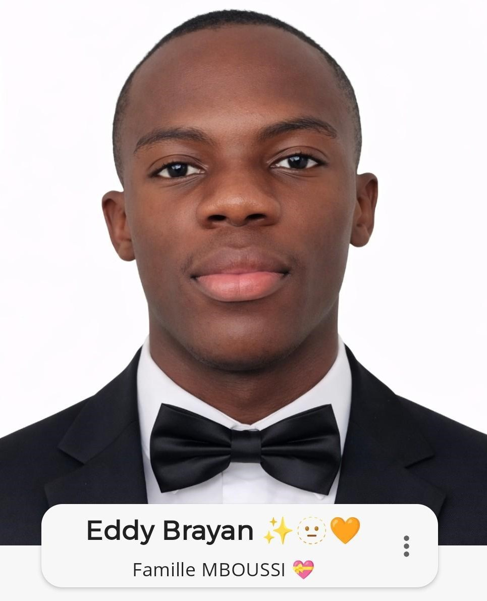

<!DOCTYPE html>
<html lang="fr">
<head>
<meta charset="UTF-8" />
<meta name="viewport" content="width=device-width, initial-scale=1.0"/>
<title>MEB Anniversaire</title>

</head>

<body>

<h1>🎉 Anniversaire MEB 🎂</h1>

<button class="btn-meb" onclick="openMagic()">
  Découvrir MEB →
</button>

<!-- OVERLAY -->

  <h2>✨ ANNIVERSAIRE D'EDDY BRAYAN ✨</h2>
  <h3>🎆 23 JUIN 2026 🎆</h3>

  <!-- 🔙 BOUTON RETOUR -->
  <button class="back-btn" onclick="closeMagic()">⬅ Retour</button>

</body>
</html>
