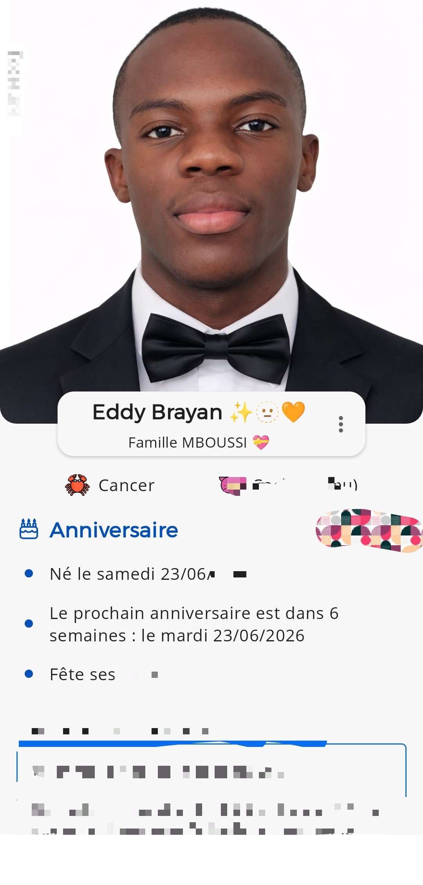

# .COM
ANNIVERSAIRE
<!DOCTYPE html>
<html lang="fr">
<head>
  <meta charset="UTF-8" />
  <meta name="viewport" content="width=device-width, initial-scale=1.0" />
  <title>Compte à rebours - Anniversaire</title>

  
</head>
<body>

  

    <h1>🎉 Anniversaire de MBOUSSI EDDY BRAYAN 🎂</h1>
    
Compte à rebours jusqu'au 23 Juin 2026

    

      

        
0

        
Jours

      

      

        
0

        
Heures

      

      

        
0

        
Minutes

      

      

        
0

        
Secondes

      

    

    

      🎊 Joyeux Anniversaire Brayan ! 🎊
    

    

      Créé spécialement pour ton anniversaire ❤️
    

  

  

</body>
</html>

